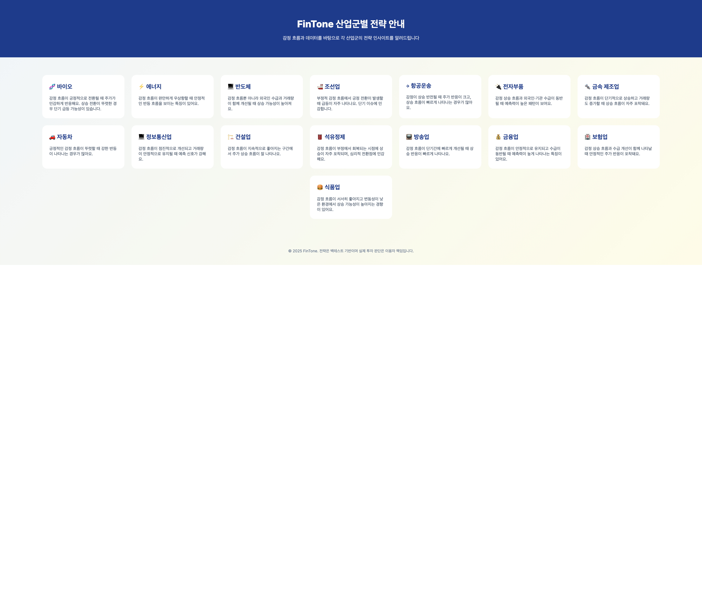
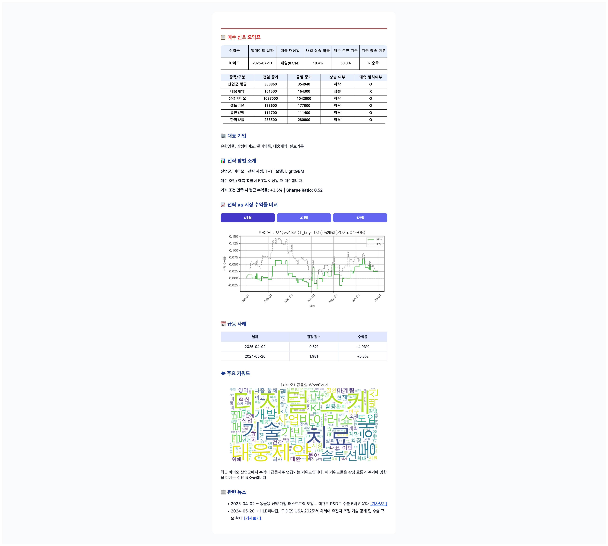

<div align="center">

# 📈 FinTone

### 뉴스 감정 분석 기반 주가 예측 및 포트폴리오 리밸런싱 시스템


**2025.05 ~ 2025.07**

</div>

---

## 🖥️ 웹 대시보드

**산업군별 전략 추천 홈페이지**



**전략 시뮬레이터 — 수익률 비교 & 워드클라우드**



---

## 📌 프로젝트 개요

뉴스 기사의 감정 점수와 외국인 수급 데이터를 결합하여 산업군별 주가 흐름을 예측하고,  
ETF 기반 포트폴리오 리밸런싱 전략을 제시하는 시스템입니다.

---

## 🗂️ 프로젝트 구조

```
fintone/
├── 뉴스수집/              # 뉴스 크롤링 (네이버, 구글) 및 전처리
├── 크롤링-전처리/         # 주가 및 외국인 수급 데이터 수집·정제
├── 주가-외국인/           # 외국인 수급 분석
├── 모델링/                # BERT 감정 분석, 모델 비교, ETF 리밸런싱
├── 시각화/                # 주가 데이터 분석 시각화
└── 웹구현/fintone/        # 웹 대시보드 (HTML/CSS)
```

---

## ⚙️ 주요 기능

| 기능 | 설명 |
|------|------|
| 📰 **뉴스 감정 분석** | BERT 모델 기반 뉴스 감정 점수화 |
| 📊 **주가 예측** | 감정 점수 + 외국인 수급 데이터 결합 예측 |
| 🔁 **포트폴리오 리밸런싱** | ETF 기반 자동 리밸런싱 전략 |
| ⚡ **실시간 급등 탐지** | 실시간 뉴스 기반 급등 종목 확률 산출 |
| 🌐 **웹 시뮬레이터** | 산업군별 전략 추천 및 백테스팅 대시보드 |

---

## 🛠️ 기술 스택

| 분류 | 기술 |
|------|------|
| 언어 | Python, HTML, CSS |
| ML/DL | PyTorch, Scikit-learn, LightGBM |
| NLP | BERT (KoBERT / FinBERT) |
| 데이터 | Pandas, NumPy |
| 크롤링 | BeautifulSoup, Selenium |
| 시각화 | Matplotlib, WordCloud |
